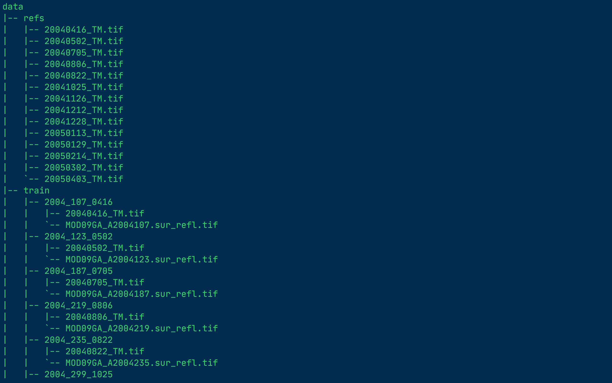
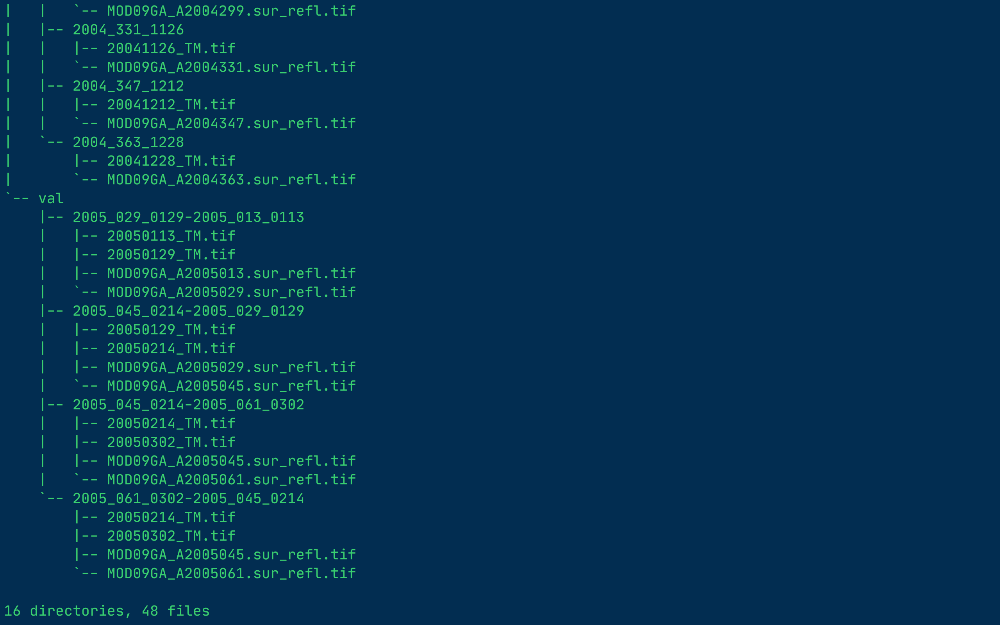

# GAN-SFTM
# A Flexible Reference-Insensitive Spatiotemporal Fusion Model for Remote Sensing Images Using Conditional Generative Adversarial Network

## 致力于帮助理解代码~
## Models

The main branch is the implementation of the GAN-STFM model.

The edcstfn branch is the implementation of the EDCSTFN model.

## Environment:

Tested on the following environment:

Python: >=3.6

PyTorch: >=0.4
# DataSat
CIA:  https://data.csiro.au/collection/csiro:5846    
LGC:  https://data.csiro.au/collection/csiro:5847v3

# Console
--lr
0.0002
--num_workers
12
--batch_size
4
--epochs
1
--cuda
--ngpu
1
--image_size
2720
3200
--save_dir
/home/zbl/datasets/STFusion/RunLog/
--data_dir
/home/zbl/datasets/STFusion/LGC/LGC_data/
--patch_size
80
80
